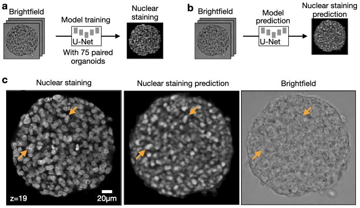

# Bright2Nuc: An easy and convinient nuclei prediction pipline from brightfield in 2D and 3D

Bright2Nuc enables experts and non-experts to predict nuclei from 2D and 3D brightfield images.

---------------------------------------------------------------------

<p align="center">
  
</p>

## Documentation

For documentation please refer to [bright2nuc](bright2nuc) for running the code.

## Datasets
Our datasets are published in Zenodo: https://doi.org/10.5281/zenodo.7014598

## Contributing
We are happy about any contributions. For any suggested changes, please send a pull request to the *develop* branch.

## Citation
If you use Bright2Nuc, please cite this preprint:

```
TO BE UPDATED
```
